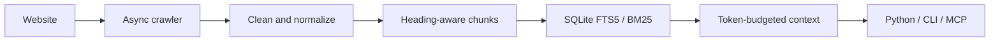

# CrawlForge

[](https://github.com/MakarenD/crawlforge/actions/workflows/ci.yml)
[](https://www.python.org/downloads/)
[](LICENSE)
[](src/crawlforge/py.typed)

CrawlForge is a local-first web-context engine for AI agents.

> Crawl once. Search locally. Send bounded context with sources.

AI agents often receive complete HTML pages containing navigation, scripts,
repeated layout blocks, and irrelevant sections. CrawlForge performs
deterministic processing locally and returns a bounded set of source-linked
chunks ranked for relevance. Retrieval remains lexical and can include
irrelevant candidates; the checked baseline below makes those limitations
visible. The same pipeline is available through Python, the CLI, or a local MCP
stdio server.

## How it works



Unlike a crawler that stops after downloading or extracting pages, CrawlForge
maintains a local retrieval index and selects complete passages under an
explicit context budget. It does not generate answers or send indexed content
to an external retrieval service.

## Key capabilities

- Asynchronous HTTP-first crawling
- Queue, depth, page, and concurrency limits
- robots.txt enforcement, rate limiting, and bounded retries
- Deterministic content cleaning and heading-aware chunking
- Local deduplicated SQLite FTS5/BM25 index
- Token-budgeted context with source provenance
- Local MCP stdio integration with bounded typed outputs
- Deterministic offline retrieval evaluation

## Quick start

After [installing from source](#installation), index a documentation site:

```bash
crawlforge index https://example.com/docs \
  --database .crawlforge/index.db \
  --max-pages 100 \
  --max-depth 2
```

Search the local index and select complete chunks within the token estimate:

```bash
crawlforge search "How are retries configured?" \
  --database .crawlforge/index.db \
  --limit 5 \
  --token-budget 3000
```

A human-readable result keeps its source and score. For example, abridged:

```text
1. Retry configuration
   URL: https://example.com/docs/retries
   BM25: -2.174630 (lower is more relevant)
   ...
Context: ~420/3000 estimated tokens, 1680 characters, 5 candidates
```

Add `--json` for machine-readable standard output. Progress and diagnostics
remain on standard error.

## Installation

The `crawlforge` package is not currently published on PyPI. Install from a
source checkout:

```bash
git clone https://github.com/MakarenD/crawlforge.git
cd crawlforge
uv sync
```

Include the optional MCP SDK integration when needed:

```bash
uv sync --extra mcp
```

Editable pip installation is also supported:

```bash
python -m pip install -e .
python -m pip install -e ".[mcp]"
```

CrawlForge requires Python 3.12 or newer and a Python SQLite build with FTS5.

## MCP integration

Start the local stdio server from the source checkout:

```bash
uv run crawlforge-mcp \
  --database .crawlforge/index.db
```

A generic stdio client configuration looks like this:

```json
{
  "mcpServers": {
    "crawlforge": {
      "command": "uv",
      "args": [
        "--directory",
        "/absolute/path/to/crawlforge",
        "run",
        "--extra",
        "mcp",
        "crawlforge-mcp",
        "--database",
        "/absolute/path/to/index.db"
      ]
    }
  }
}
```

The server exposes four tools:

- `index_site` crawls and indexes within server-owned limits;
- `search_index` returns BM25-ranked chunks;
- `build_context` returns a bounded source-linked context;
- `get_index_info` reports local index readiness and counts.

MCP runs locally over stdio, and the SQLite database remains under the user's
control. Web content is untrusted data. Public HTTP(S) targets are allowed by
default, while private and non-routable network targets are blocked. See the
[MCP server documentation](docs/mcp.md) for configuration, tool schemas,
limits, and the complete trust model.

## Retrieval evaluation

The checked-in offline benchmark runs the production cleaning, chunking,
indexing, and public search path against graded section-level relevance
judgments. The current baseline contains 10 original HTML documents, 40 stable
sections, 50 indexed chunks, 64 queries, 114 positive judgments, and 8 query
categories.

Aggregate BM25 results from the current
[JSON report](reports/bm25-baseline.json):

| Metric | BM25 baseline |
| --- | ---: |
| Hit Rate@5 | 96.4% |
| Precision@5 | 28.9% |
| Recall@5 | 80.2% |
| MRR | 0.8681 |
| MAP@5 | 0.7294 |
| NDCG@5 | 0.8100 |

Selected category results:

| Category | Hit@5 | Recall@5 | MRR |
| --- | ---: | ---: | ---: |
| Exact term | 100.0% | 100.0% | 1.0000 |
| Code symbol | 100.0% | 100.0% | 1.0000 |
| Paraphrase | 87.5% | 81.2% | 0.7639 |
| Conceptual | 100.0% | 81.2% | 0.7083 |
| Ambiguous | 87.5% | 40.6% | 0.6667 |

Exact terms and code symbols are strong on this corpus. Paraphrases and short
ambiguous queries are harder, and strict negative-query no-result accuracy is
only 12.5%. This dataset is small and synthetic; it is useful for deterministic
regression analysis, not broad external validity. Raw FTS5 BM25 scores are not
calibrated confidence values, token counts are model-agnostic estimates, and
latency depends on the machine.

See the complete [Markdown report](reports/bm25-baseline.md) and
[evaluation methodology](docs/retrieval-evaluation.md).

## Python API

`ContextEngine` owns crawling-to-index ingestion, lexical search, bounded
context selection, and SQLite lifecycle:

```python
import asyncio

from crawlforge import ContextEngine


async def main() -> None:
    async with ContextEngine(".crawlforge/index.db") as engine:
        await engine.ingest_url(
            "https://example.com/docs",
            max_pages=100,
            max_depth=2,
        )
        context = await engine.build_context(
            "How are retries configured?",
            limit=10,
            token_budget=3000,
        )

    for hit in context.hits:
        print(hit.chunk.text)
        print(hit.source.url)


asyncio.run(main())
```

`SearchHit.bm25_score` is the raw SQLite FTS5 score; lower values are more
relevant. See [Web-context architecture](docs/web-context.md) for processing,
chunking, schema, deduplication, migrations, and metrics.

## Standalone crawler

The asynchronous crawler remains a standalone public component:

```python
import asyncio

from crawlforge import AsyncCrawler


async def main() -> None:
    async with AsyncCrawler(
        max_concurrent=10,
        max_concurrent_per_domain=2,
        max_depth=2,
    ) as crawler:
        pages = await crawler.crawl(
            ["https://example.com"],
            max_pages=50,
            same_domain_only=True,
        )

    print(f"Processed: {len(pages)}")
    print(f"Failed: {len(crawler.failed_urls)}")


asyncio.run(main())
```

Sitemaps, JSON configuration, statistics, reports, queue behavior, politeness,
retries, parsing, storage backends, examples, benchmarks, and the full crawler
CLI are documented in [Crawler and storage](docs/crawler.md).

## Security and trust model

- The crawler respects robots.txt and applies configured rate limits and
  retries.
- MCP indexing allows public HTTP(S) targets only by default.
- Literal IPs, DNS answers, and every redirect destination pass SSRF checks.
- Page sizes, robots.txt sizes, crawl duration, page counts, search results,
  context budgets, and serialized output are bounded.
- External page text remains untrusted content rather than application or MCP
  instructions.
- Source URLs and heading paths remain available as provenance.

See [MCP server](docs/mcp.md) for the detailed network policy and operation
limits.

## Current limitations

- Lexical BM25 only; no embeddings, vector search, or hybrid search
- No reranker or generated answers
- No JavaScript browser rendering
- Approximate, model-agnostic token estimator
- SQLite FTS5 is required
- Local stdio MCP only
- Negative-query abstention is not calibrated

## Documentation

- [Web-context architecture](docs/web-context.md)
- [MCP server](docs/mcp.md)
- [Retrieval evaluation](docs/retrieval-evaluation.md)
- [Crawler and storage](docs/crawler.md)

## Development

```bash
uv sync --extra dev --extra mcp
uv run pytest
uv run ruff check .
uv run ruff format --check .
uv run mypy src
```

GitHub Actions runs the test suite on Python 3.12, 3.13, and 3.14, with
linting, formatting, type checking, CLI, dependency, and package-build checks.

## Roadmap

- Semantic embeddings baseline
- BM25 versus semantic comparison
- Hybrid retrieval
- Reranking
- Calibrated negative-query abstention
- Larger real-world evaluation corpora
- Optional browser rendering

These items describe possible next evaluations and extensions, not committed
release dates.

## License

Distributed under the [MIT License](LICENSE).
